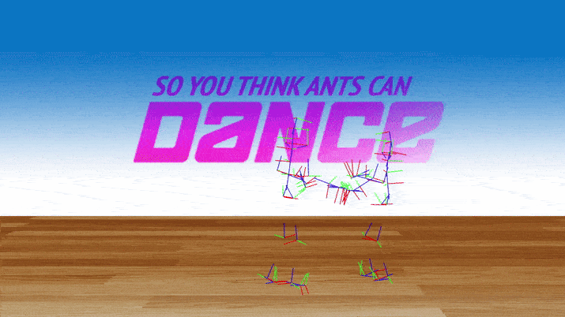

# So You Think Ants Can Dance
Hierarchial character animation system using motion capture data.

## Demo


## Features
- Hierarchical scene graph for rendering articulated humanoid characters with recursive transformations
- Smooth trajectory planning for transitions between motion clips
- Runtime overlay of motion clips for interactive animation

## Build instructions

1. Install [Node.js](https://nodejs.org/).

2. Install dependencies.
```bash
npm install
```

3. Launch development server.
```bash
npm run start
```

## Credit

- Motion capture data from [Carnegie Mellon motion capture database](http://mocap.cs.cmu.edu/).

## License

Material for [CSCI 4611 Spring 2024](https://github.com/CSCI-4611-Spring-2024/Syllabus) by [Evan Suma Rosenberg](https://illusioneering.umn.edu/) is licensed under a [Creative Commons Attribution-NonCommercial-ShareAlike 4.0 International License](http://creativecommons.org/licenses/by-nc-sa/4.0/).